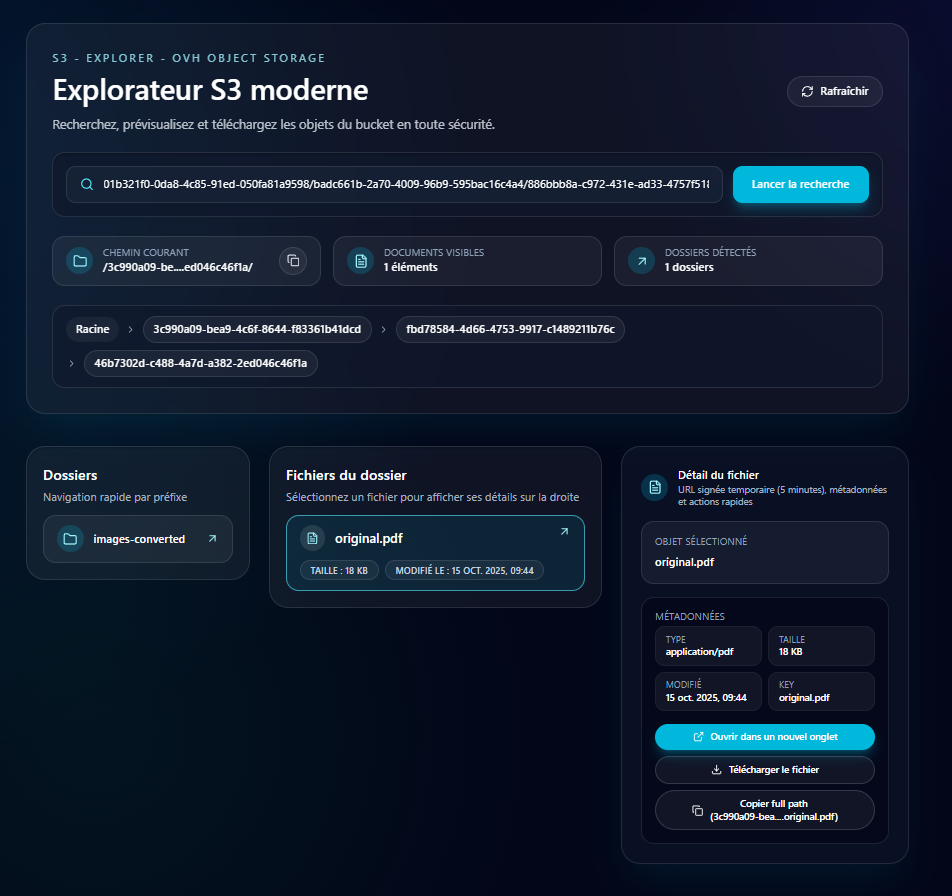

# S3 Explorer

A lightweight web UI to browse an S3 bucket. Point the app at any S3-compatible endpoint (AWS, OVH Object Storage, MinIO, etc.), authenticate with access keys, and explore objects directly from the browser.



## Quick start (local)

```bash
yarn
yarn dev
```

## Environment variables

Set these before running locally or in Docker:

- `S3_ENDPOINT`
- `S3_REGION`
- `S3_ACCESS_KEY`
- `S3_SECRET_KEY`
- `S3_BUCKET`

## Docker

Build the image:

```bash
docker build -t mycontainer:version1 .
```

Run the container (example for OVH Object Storage):

```bash
docker run -d -p 3000:3000 \
  -e S3_ENDPOINT=https://s3.gra.io.cloud.ovh.net \
  -e S3_REGION=gra \
  -e S3_ACCESS_KEY=xxxx \
  -e S3_SECRET_KEY=xxxxx \
  -e S3_BUCKET=xxx-bucket \
  mycontainer:version1
```

The app listens on port 3000 by default. Access it at http://localhost:3000 after the container starts.
